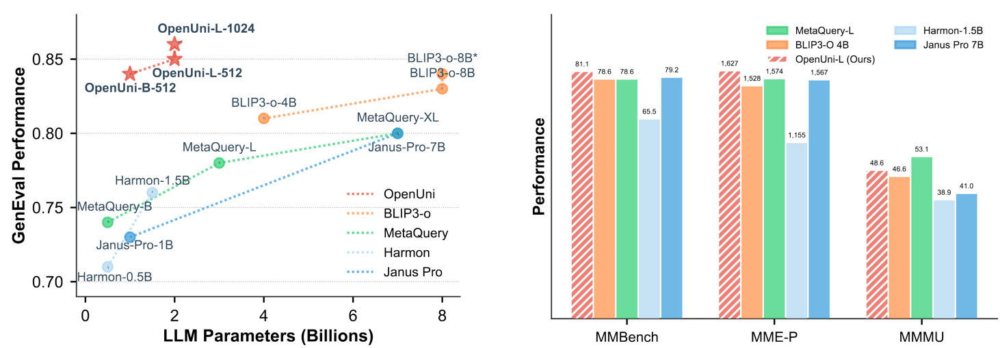

# OpenUni: A Simple Baseline for Unified Multimodal Understanding and Generation



> **[OpenUni: A Simple Baseline for Unified Multimodal Understanding and Generation](https://arxiv.org/abs/2505.23661)**
>
> Authors: Size Wu, Zhonghua Wu, Zerui Gong, Qingyi Tao, Sheng Jin, Qinyue Li, Wei Li, Chen Change Loy
>
> [](https://arxiv.org/abs/2505.23661) 
> [](https://github.com/wusize/OpenUni?tab=readme-ov-file#-citation)

## Introduction

Welcome to the OpenUni repository! OpenUni is an open-source implementation inspired by [MetaQuery](https://xichenpan.com/metaquery) that aims to unify multimodal understanding and generation. Our approach is minimalist, yet effective. 

OpenUni can:

1. Generate high-quality, instruction-aligned images.
2. Achieve outstanding performance on benchmarks like GenEval, DPG-Bench, and WISE, using only 1.1B and 3.1B activated parameters.

This repository is still under construction, but we invite you to explore its features and contribute to its development.

## Features

- **Unified Architecture**: Simplified design that integrates multiple modalities.
- **High-Quality Image Generation**: Produces images that align well with given instructions.
- **Benchmark Performance**: Excels in standard evaluation metrics with fewer parameters.

## Installation

To get started with OpenUni, follow these steps:

1. Clone the repository:

   ```bash
   git clone https://github.com/wusize/OpenUni.git
   cd OpenUni
   ```

2. Install the required dependencies. You can do this using pip:

   ```bash
   pip install -r requirements.txt
   ```

3. Download the necessary model weights and files. You can find the latest releases [here](https://github.com/wandinho/OpenUni/releases). Make sure to download the files and execute them as instructed.

## Usage

To use OpenUni for multimodal tasks, you can run the following command:

```bash
python main.py --task <your_task> --input <your_input>
```

Replace `<your_task>` with the desired task name and `<your_input>` with the input data you want to process.

### Example

Here’s a simple example of how to generate an image based on a text instruction:

```bash
python main.py --task generate_image --input "A sunset over the mountains"
```

## Documentation

For detailed documentation on how to use OpenUni, please refer to our [documentation](docs/report.pdf).

## Contributing

We welcome contributions from the community. If you want to contribute to OpenUni, please follow these steps:

1. Fork the repository.
2. Create a new branch for your feature or bug fix.
3. Make your changes and commit them.
4. Push to your forked repository.
5. Create a pull request.

Please ensure that your code follows the existing style and includes appropriate tests.

## Citation

If you use OpenUni in your research, please cite our paper:

```bibtex
@article{OpenUni,
  title={OpenUni: A Simple Baseline for Unified Multimodal Understanding and Generation},
  author={Size Wu and Zhonghua Wu and Zerui Gong and Qingyi Tao and Sheng Jin and Qinyue Li and Wei Li and Chen Change Loy},
  journal={arXiv preprint arXiv:2505.23661},
  year={2023}
}
```

## License

OpenUni is licensed under the MIT License. See the [LICENSE](LICENSE) file for more information.

## Support

If you encounter any issues or have questions, please open an issue in the GitHub repository. We will do our best to assist you.

## Roadmap

We have a clear roadmap for the future development of OpenUni:

- **Feature Enhancements**: Add new features based on community feedback.
- **Performance Improvements**: Optimize the model for better efficiency.
- **Extended Documentation**: Provide more examples and use cases.

## Acknowledgments

We would like to thank the contributors and the community for their support. Special thanks to the authors of MetaQuery for their foundational work in this area.

## Releases

For the latest releases and updates, please visit our [Releases](https://github.com/wandinho/OpenUni/releases) section. Download the necessary files and execute them as needed.

## Conclusion

Thank you for exploring OpenUni. We hope you find it useful for your multimodal understanding and generation tasks. Your feedback and contributions are invaluable to us as we continue to improve this project.